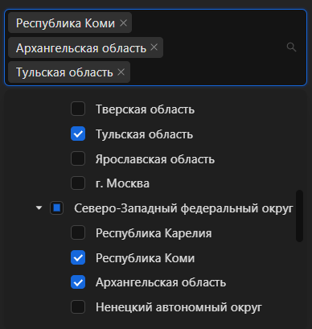

# Введение

Это веб-приложение было создано в рамках научной работы, которая выполнялась для "Центрального НИИ Эпидемиологии Роспотребнадзора".

Данное приложение позволяет проводить демографический и эпидемиологический анализ субъектов Россиской Федерации на основе данных из Росстата за 2009-2023 годы (кроме 2011).

Более точно, данное приложение позволяет:

<ol style="display: flex; flex-direction: column; gap: 1em">
    <li>
        Получать данные о половозрастном составе субъектов РФ за произвольный год в
        диапазоне 2009-2023 лет;
    </li>
    <li>
        То же для среза данных по указанным промежуткам лет;
    </li>
    <li>
        Выгружать данные о демографии в excel;
    </li>
    <li>
        Рассчитывать коэффициент половозрастной коррекции;
    </li>
    <li>
        Рассчитать ряд эпидемиологических показателей;
    </li>
    <li>
        Визуализировать полученные данные (графики, картография).
    </li>
</ol>

# Рассчитываемые эпид. показатели

<ol style="display: flex; flex-direction: column; gap: 1em">
    <li>
        <b>Интенсивная заболеваемость</b> (на 100 тысяч человек) для выбранных регионов и Российской Федерации в целом за указанный год;
    </li>
    <li>
        <b>Верхний и нижний доверительный интервал для интенсивной заболеваемости</b> для выбранных регионов и Российской Федерации в целом за указанный
год;
    </li>
    <li>
        <b>Стандартизованная абсолютная заболеваемость</b> для выбранных регионов
за указанный год;
    </li>
    <li>
        <b>Стандартизованная интенсивная заболеваемость</b> для выбранных регионов
за указанный год;
    </li>
    <li>
        <b>Риск инфицирования</b> для выбранных регионов и Российской Федерации
в целом за указанный год;
    </li>
    <li>
        <b>Выявляемость заболевания</b> для выбранных регионов и Российской Федерации в целом за указанный год;
    </li>
    <li>
        <b>Контактное число</b> для выбранных регионов и Российской Федерации в
целом за указанный год;
    </li>
</ol>

# Используемые библиотеки

Данное приложение написано с использованием таких технологий как: TypeScript, React, Ant Design,Tailwind CSS, Plotly, ExcelJS.

# Пример работы

## Выбор субъекта(-ов) РФ

## Данные по демографии в табличном виде

## Данные по демографии в виде графиков

## Ввод данных по заболеваемости

## Расчет введенных данных по заболеваемости

## Построение графиков на основе данных по заболеваемости

## Работа с картами РФ в приложении

